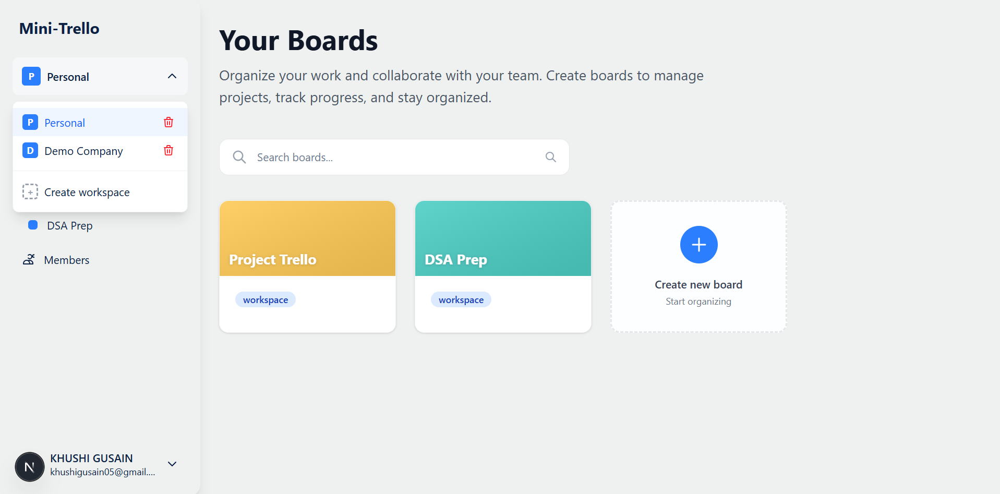
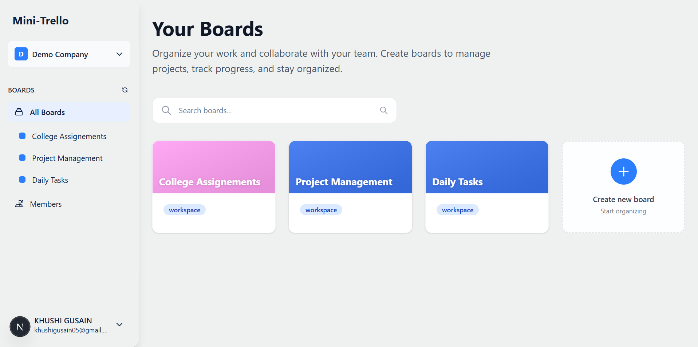
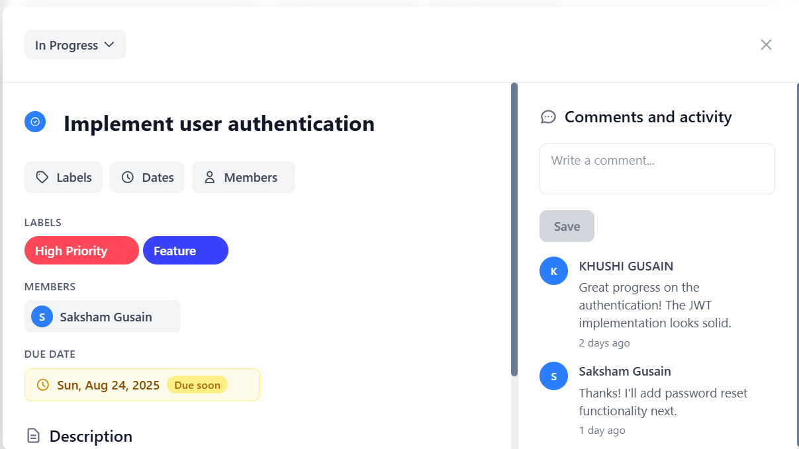
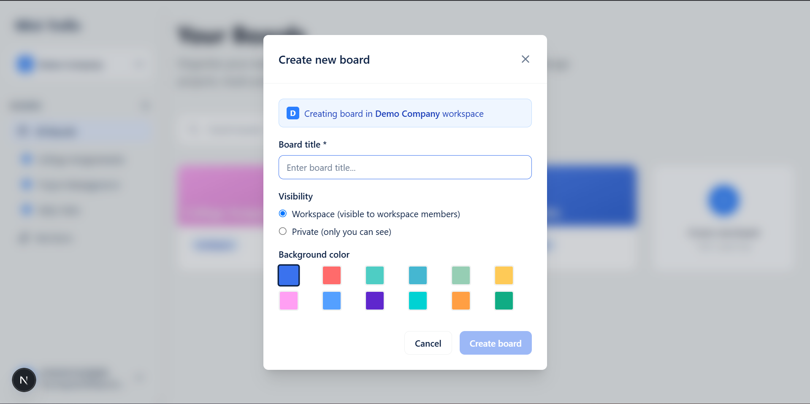
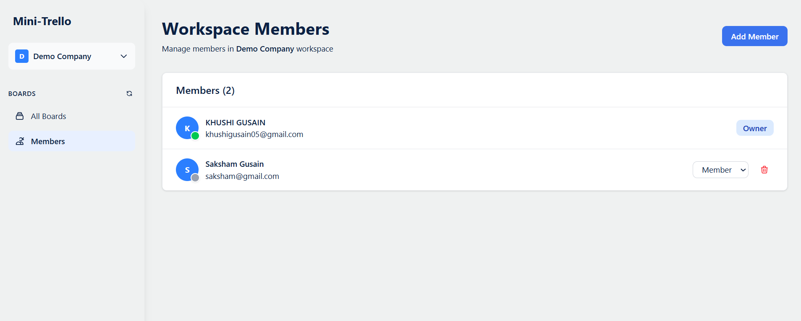

# Mini Trello  

A lightweight, real-time Trello-inspired app built with **Next.js** and **Supabase**, designed to make task and project management simple, collaborative, and fast.  

## Tech Stack & Why I Chose It  

- **Frontend**: Next.js 15 (App Router) → server-side rendering, great performance, and smooth developer experience.  
- **Backend**: Supabase → handles database, authentication, and real-time updates in one place.  
- **Styling**: Tailwind CSS → clean, responsive UI built quickly with consistent theming.  
- **Real-time**: Supabase Realtime → enables live updates like presence indicators and collaboration.  

This stack was chosen because it covers everything needed for a real-time, multi-user app with minimal setup and strong integration between frontend and backend.  

## Key Features  

- **Authentication** – Secure login with email/password and social providers (Supabase Auth).  
- **Workspaces** – Create and switch between multiple workspaces.  
- **Real-time Collaboration** – See live presence and updates instantly from other members.  
- **Kanban Boards** – Organize tasks into lists with drag-and-drop cards.  
- **Labels & Assignees** – Add labels and assign team members to tasks.  
- **Comments** – Discuss tasks in real time directly on cards.  
- **Due Dates** – Track deadlines with clear visual reminders.  
- **Search & Filters** – Quickly find cards by title, label, or assignee.  
- **Responsive UI** – Works seamlessly on both desktop and mobile.  

## 🛠️ Installation Process

### Quick Start
1. **Pull the code from GitHub**
   ```bash
   git clone https://github.com/KhushiGusain/trello-mini.git
   cd trello-mini
   ```

2. **Create env file in root directory**
   Create a `.env.local` file in the root directory and copy data from: [Environment Variables](https://anotepad.com/note/read/cssrnwcj)

3. **Install dependencies**
   ```bash
   npm install
   ```

4. **Run the development server**
   ```bash
   npm run dev
   ```

### Alternative: Use Hosted Version
**Hosted on Google Cloud**: [https://treeeee-89641958063.asia-south2.run.app/](https://treeeee-89641958063.asia-south2.run.app/)

### Login Details
Use these login details:
- **Email**: khushigusain05@gmail.com | **Password**: admin123
- **Email**: saksham@gmail.com | **Password**: admin123

### Database Schema
For the complete database schema diagram, visit: [Database Schema](https://dbdiagram.io/d/68a8f8531e7a6119673877b7)


### 6. Real-time Features
Real-time features are automatically enabled through Supabase Realtime. No additional server setup required.

## 📱 Screenshots

### Authentication & User Interface


### Personal Boards Dashboard


### Workspace Boards Overview


### Kanban Board Interface
![Kanban board with lists, cards, and drag-and-drop functionality]

### Card Details & Management


### Create New Board Modal


### Workspace Member Management


## Next Steps

- [ ] **File Attachments**: Add drag-and-drop file upload to cards
- [ ] **Advanced Permissions**: Implement granular role-based access control
- [ ] **Offline Support**: Add service worker for offline functionality
- [ ] **Integrations**: Add Slack, GitHub, and other third-party integrations
- [ ] **Templates**: Create board and card templates
- [ ] **Advanced Analytics**: Add board usage analytics and insights
- [ ] **Advanced Search**: Implement full-text search with filters
- [ ] **Dark Mode**: Implement dark theme support

