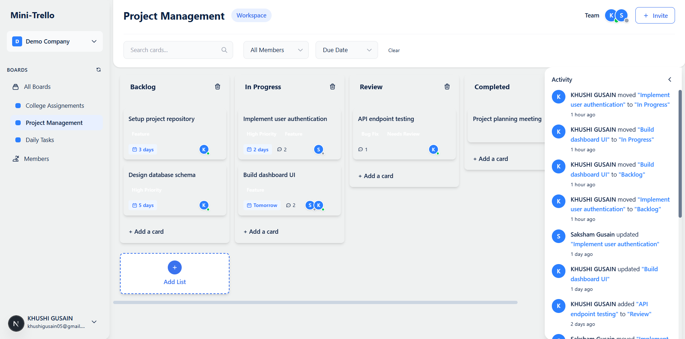

# Mini Trello  

A lightweight, real-time Trello-inspired app built with **Next.js** and **Supabase**, designed to make task and project management simple, collaborative, and fast.  

## Tech Stack & Why I Chose It  

- **Frontend**: Next.js 15 (App Router) → server-side rendering, great performance, and smooth developer experience.  
- **Backend**: Supabase → handles database, authentication, and real-time updates in one place.  
- **Styling**: Tailwind CSS → clean, responsive UI built quickly with consistent theming.  
- **Real-time**: Supabase Realtime → enables live updates like presence indicators and collaboration.  

This stack was chosen because it covers everything needed for a real-time, multi-user app with minimal setup and strong integration between frontend and backend.  

## Key Features  

- **Authentication** – Secure login with email/password and social providers (Supabase Auth).  
- **Workspaces** – Create and switch between multiple workspaces.  
- **Real-time Collaboration** – See live presence and updates instantly from other members.  
- **Kanban Boards** – Organize tasks into lists with drag-and-drop cards.  
- **Labels & Assignees** – Add labels and assign team members to tasks.  
- **Comments** – Discuss tasks in real time directly on cards.  
- **Due Dates** – Track deadlines with clear visual reminders.  
- **Search & Filters** – Quickly find cards by title, label, or assignee.  
- **Responsive UI** – Works seamlessly on both desktop and mobile.  

## 🛠️ Setup Instructions

### Prerequisites
- Node.js 18+ 
- npm or yarn
- Supabase account

### 1. Install Dependencies
```bash
npm install
# or
yarn install
```

### 2. Environment Setup
Create a `.env.local` file in the root directory:
```bash
cp .env.example .env.local
```
Fill in your Supabase credentials. For environment variables reference, visit: [Environment Variables](https://anotepad.com/note/read/cssrnwcj)

### 3. Database Setup
1. Create a new Supabase project
2. Go to your Supabase SQL Editor
3. Copy and paste the SQL contents from: [Database Schema](https://dbdiagram.io/d/68a8f8531e7a6119673877b7)
4. Execute the script to create all tables, indexes.

### 4. Create Test Accounts
1. Start the development server:
```bash
npm run dev
# or
yarn dev
```
2. Open [http://localhost:3000](http://localhost:3000)
3. Create at least 2 user accounts through the signup page for collaboration testing.
4. The database script will automatically use these accounts to create sample data

### 5. Run the Development Server
```bash
npm run dev
# or
yarn dev
```

### 6. Real-time Features
Real-time features are automatically enabled through Supabase Realtime. No additional server setup required.

## 🗄️ Database Schema Overview

For the complete database schema diagram, visit: [Database Schema](https://dbdiagram.io/d/68a8f8531e7a6119673877b7)


### Key Features
- **Real-time updates** via Supabase Realtime
- **Row Level Security** for data protection
- **Full-text search** on card titles and descriptions
- **Audit trail** with activity logging

## 📱 Screenshots

### Authentication & User Interface


### Personal Boards Dashboard


### Workspace Boards Overview


### Kanban Board Interface


### Card Details & Management


### Create New Board Modal


### Workspace Member Management


## 🚀 Live Demo

**Live Demo**: [https://treeeee-89641958063.asia-south2.run.app/](https://treeeee-89641958063.asia-south2.run.app/)

### Test Accounts for Interviewers
For easy testing experience, use these pre-loaded accounts:
- **Email**: khushigusain05@gmail.com | **Password**: admin123
- **Email**: saksham@gmail.com | **Password**: admin123

These accounts have dummy data loaded for a complete demonstration of all features.


### Manual Deployment
```bash
npm run build
npm start
```

## Next Steps

- [ ] **File Attachments**: Add drag-and-drop file upload to cards
- [ ] **Advanced Permissions**: Implement granular role-based access control
- [ ] **Offline Support**: Add service worker for offline functionality
- [ ] **Integrations**: Add Slack, GitHub, and other third-party integrations
- [ ] **Templates**: Create board and card templates
- [ ] **Advanced Analytics**: Add board usage analytics and insights
- [ ] **Advanced Search**: Implement full-text search with filters
- [ ] **Dark Mode**: Implement dark theme support

